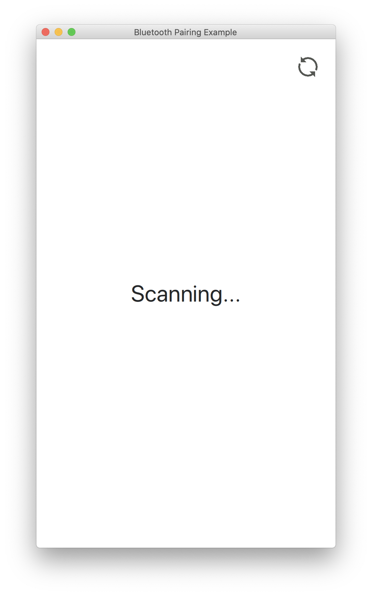

# qtBluetoothDevicePairing
qtbluetoothdevicepairing is a simple Qt application that scans for available Bluetooth devices and displays a list of all. When some list item is clicked from the devices list, the application pairs with the respective device.

# Build
qtbluetoothdevicepairing uses qmake for building. To build it run:  
``mkdir build && cd build``

From the *build* folder, run:  
``
path/to/your/Qt/bin/qmake ../qtbluetoothdevicepairing/
``  

then:  
``make``

This will create the *qtbluetoothdevicepairing* executable inside the build folder.

# Running the application
From the *build* folder, run
``
./qtbluetoothdevicepairing
``

#### devices_list.png  
  
#### device_paired.png  
  
#### scanning.png  
  
#### no_devices.png  
 

# License
This software is available under the following license:  
MIT
